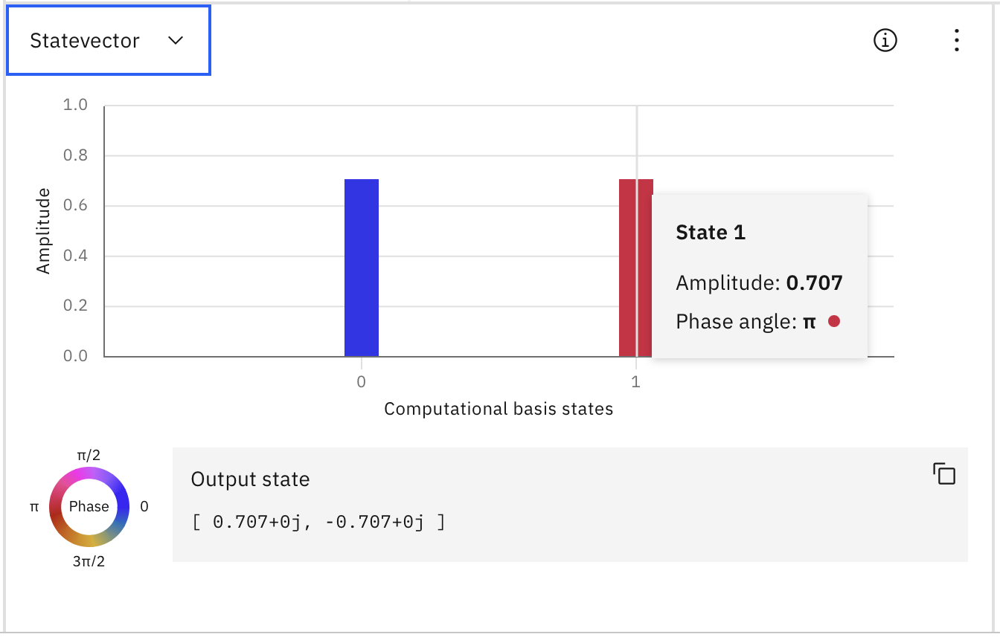

# Flydown of quantum composer

In Quantum Composer we set up a single qubit, initialize it to the zero-state and apply a not and the Hadamard gate.
We can see in the Statevector view that the one-state has a phase of $\pi$, that value isn't casual but it's given by
Euler's representation of complex numbers:

An imaginary number can be represented as $c e^{i \phi}$ and when $\phi = \pi$ then this equals $-c$.

Numbering of bits follows the classic computer science notation for bits, where the leftmost bit is the most
significant bit.

