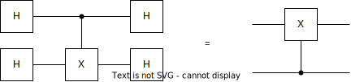

# Deutsch problem

...

so the blackbox representation of the function can be one in four possibilities. We don't know in which of the four cases
we are, it can be shown that a solution to the Deutsch's problem is to put and Hadamard port in both register at the beginning.

Remember these identities:

$$
HH = I \\
HXH = Z \\
HZH = X \\
X_{01} = H_{01}Z_{01}H_{01} \\
...
$$

## Bernstein-Vazirani

Let a be an integer in [0, 2^n]. Let f(x) = ax mod 2, so the bitwise XOR of the AND of a and x. The XOR is given by the
modulo 2.

Classically from the output you cannot recover the input, without creating a new transformation implementing f.

We want to discover the secret key f. We feed it an input and we find out an output. From a classical POV, you need
to run the function n times. From the quantum POV just once.

Let $U_f$ be a quantum version of the function:

list the key bits, if the key equals to zero do nothing (where making an AND), otherwise put a control-x (CNOT) for those
qubits that are 1.
The output register switches state for each key put to 1.

$$
f_a(x): \mathbb B^n \to \mathbb B
$$

Multiple bit input and single bit output. The quantum version:

$$
U_f = (\vert x \rangle_n, \vert y \rangle)
$$

The network is able to entangle the input to the register of the key. By applying Hadamard to both ends of U you obtain
the secret key.
